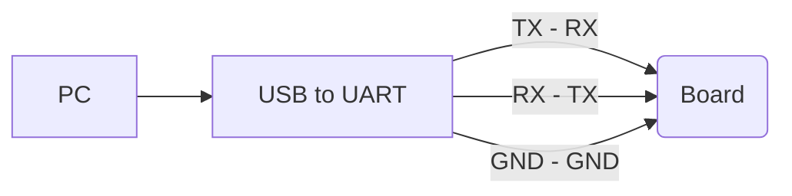

# MyoPi 🚀
## _Make Your Own Pi_

MyoPi is an open-source platform inspired by existing mini PC solutions in the market. With its compact design and powerful performance, MyoPi stands out, offering limitless creative potential for technology enthusiasts. Designed to empower users to shape their own digital worlds, MyoPi is versatile, suitable for a wide range of applications from IoT projects to educational applications. Its open-source nature provides users with an experience filled with innovation and freedom. Explore technology with MyoPi, push boundaries, and create your own digital future.


&nbsp;

### FEATURES
| Feature                | Details                                                   |
|------------------------|-----------------------------------------------------------|
| CPU                    | Allwinner H616/H618 Quad-Core Cortex-A53 Processor 1.5GHz |
| GPU                    | Mali G31 MP2                                              |
| RAM                    | LPDDR4: 1GB/2GB/4GB                                       |
| STORAGE                | 16GB eMMC5.1 Onboard                                      |
| SD CARD                | Micro SD card interface                                   |
| WIFI+BT                | WIFI/BT5.0                                                |
| ETHERNET               | Support 10M/100M                                          |
| VIDEO/AUDIO OUTPUT     | HDMI-A supporting 4K@60FPS                                |
| USB                    | Type-C USB2.0x2                                           |
| DEBUG                  | Uart TX/RX/GND                                            |
| LED                    | Status Led                                                |
| OS                     | Ubuntu 22.04                                              |
| PCB Size               | 50mm x 50mm                                               |

> The system has been tested with 2GB of RAM and supports a maximum of 4GB.

&nbsp;
### HARDWARE
| File | Link |
| ------ | ------ |
| Schematic | [fatas07/make-your-own-pi/Hardware/1-Schematic/ID-CORE Schematic R1_2.pdf][Schematic] |
| Gerber | [fatas07/make-your-own-pi/Hardware/2-Gerber/Project Outputs for ID-CORE R1_2.rar][Gerber] |
| Documentation | [fatas07/make-your-own-pi/Documentation][Documentation] |

---

| Pcb | Value |
| ------ | ------ |
| Name | ID-CORE |
| Dimensions | 50mm x 50mm |
| Material | FR-4 (TG150-TG160) |
| Layer | 8-Layer |
| Thickness | 1.2mm |
| Surface Finish | ENIG (2U")|
| Outer Copper Weight | 1 oz |
| Inner Copper Weight | 0.5oz |
| Via Covering | Epoxy Filled & Capped |
| Impedance Control | [fatas07/Documentation/1-Pcb/1-Specs/PCB Specs.xlsx][Impedance] |

>  [JLCPCB][Jlcpcb]  special 8-Layer PCB offer only 2$

&nbsp;

### SOFTWARE
| OS Image | Link |
| ------ | ------ |
| Ubuntu 22.04 | 🔜 Soon |
&nbsp;

### BOOT STATUS
| SD Card | eMMC | Status |
| ------ | ------ |------ |
| Empty | Empty | ❌ |
| Not Inserted | Empty | ❌ |
| Not Inserted | Ubuntu 22.04 | ❌ |
| Ubuntu 22.04 | Empty | ✅ Boot from SD card |
| Empty | Ubuntu 22.04 | ✅ Boot from eEMMC |
| Ubuntu 22.04 | Ubuntu 22.04 | ✅ Boot from SD card |
> If boot from SD card, eMMC usage is external storage
> If boot from eMMC, please insert empty SD card for external storage (must)

&nbsp;

### TEST CASES
| Peripheral | Status |
| ------ | ------ |
| SD Card Boot | ✅ |
| SD Card Storage | ✅ |
| eMMC Boot | ✅ |
| eMMC Storage | ✅ |
| USB-0 Host | ✅ |
| USB-1 Host | ✅ |
| Ethernet 10M/100M | ✅ |
| HDMI | ✅ |
| Debug Uart | ✅ |
| Status Led | ✅ |
| Wifi | ❔ Will be test |
| Bluetooth | ❔ Will be test |

> * All testing processes were performed by crossing the incorrectly drawn HDMI SCL and SDA pins on the R1.0 PCB.
> * The R1.2 PCB is a fix for the HDMI SCL and SDA pins that were drawn incorrectly in the R1.0.

&nbsp;

### DEVELOPMENT
#### Burning Linux Image to Micro SD Card
If you are using Windows operating system, you can use balenaetcher.
If you are using Linux operating system, you can burn the image with disks (gnome-disks-utility).

#### Burning Linux Image to eMMC

- First, we burning the Linux image on the SD card and boot from the SD card to confirm that the system boots normally.
- If the system boots normally, we copy the Linux image to an accessible place on the SD card and boot the system again with the SD card. (The process can also be proceeded by copying the Linux image file to a USB memory instead of an SD card)
###
We find the naming of the emmc on the card by the operating system with the following command. 

We will see an image like below. (<font color='red'>0</font> may change)
mmcblk<font color='red'>0</font> 
mmcblk<font color='red'>0</font>boot0 
mmcblk<font color='red'>0</font>boot1
```sh
lsblk
```
⚡️We will continue our process assuming the mmc memory is named mmcblk0.

🔹Format eMMC
```sh
sudo dd bs=1M if=/dev/zero of=/dev/mmcblk0  count=1000 status=progress
```
🔹Synchronize
```sh
sudo sync
```
🔹Burn Linux image to eMMC 
Open the terminal where the linux image file is located
Change name <font color='red'>linux-image-file</font> to real name
```sh
sudo dd bs=1M if=linux-image-file.img of=/dev/mmcblk0  status=progress
```
🔹Synchronize
```sh
sudo sync
```
👉 If all operations are completed successfully, when you format the SD card and insert it into the card, the system will boot via eMMC and see the SD card as external storage.

#### Debug With UART Serial Port
You can debug using putty. (115200bps)

❗ The board debug uart voltage level is 3.3V. Please make sure the uart voltage level of your Usb uart converter is 3.3V.



   [Schematic]: <https://github.com/fatas07/make-your-own-pi/blob/main/Hardware/1-Schematic/ID-CORE%20Schematic%20R1_2.pdf>
   [Gerber]: <https://github.com/fatas07/make-your-own-pi/blob/main/Hardware/2-Gerber/Project%20Outputs%20for%20ID-CORE%20R1_2.rar>
   [Documentation]: <https://github.com/fatas07/make-your-own-pi/tree/main/Documentation>
   [Impedance]: <https://github.com/fatas07/make-your-own-pi/blob/main/Documentation/1-Pcb/1-Specs/PCB%20Specs.xlsx>
   [Jlcpcb]: <https://jlcpcb.com>
