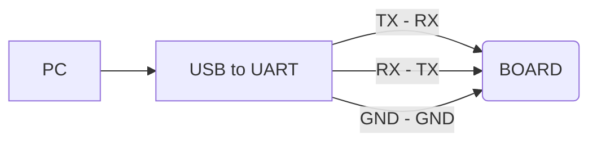

# MyoPi 🚀
## 📢 _Make Your Own Pi_

MyoPi is an open source embedded Linux computer project inspired by existing mini PC (Fruit Pi) solutions on the market to create your own mini PC. With its strong, compact and flexible structure, it offers an ideal platform that can be used in various projects. It allows developers and tech enthusiasts to build and customize their own personal computers. MyoPi, which can be used both for educational purposes and in various projects, offers users a low-cost and high-performance solution.

MyoPi is not just a computer but also a learning platform. It is an ideal tool for those who want to have knowledge about both software and hardware. With MyoPi, you can realize your own projects, learn new things and get one step ahead in the world of technology.

Explore technology, push the boundaries and create your own digital future with MyoPi.


&nbsp;

### 🔶 FEATURES
| Feature                | Details                                                   |
|------------------------|-----------------------------------------------------------|
| CPU                    | Allwinner H616/H618 Quad-Core Cortex-A53 Processor 1.5GHz |
| GPU                    | Mali G31 MP2                                              |
| RAM                    | LPDDR4: 1GB/2GB/4GB                                       |
| STORAGE                | 8GB eMMC5.1 Onboard                                      |
| SD CARD                | Micro SD card interface                                   |
| WIFI+BT                | WIFI/BT5.0                                                |
| ETHERNET               | Support 10M/100M                                          |
| VIDEO/AUDIO OUTPUT     | HDMI-A supporting 4K@60FPS                                |
| USB                    | Type-C USB2.0 x 2                                           |
| DEBUG                  | Uart TX/RX/GND                                            |
| LED                    | Status Led                                                |
| OS                     | Ubuntu 22.04                                              |
| PCB Size               | 50mm x 50mm                                               |

> The system has been tested with 2GB of RAM and supports a maximum of 4GB.  
> The system has been tested with 8GB eMMC and can be increased upon request.

&nbsp;

### 🔶 HARDWARE
| File | Link |
| ------ | ------ |
| Schematic | [fatas07/make-your-own-pi/Hardware/1-Schematic/ID-CORE Schematic R1_2.pdf][Schematic] |
| Gerber | [fatas07/make-your-own-pi/Hardware/2-Gerber/Project Outputs for ID-CORE R1_2.rar][Gerber] |
| Documentation | [fatas07/make-your-own-pi/Documentation][Documentation] |

###

| Pcb | Value |
| ------ | ------ |
| Name | ID-CORE |
| Dimensions | 50mm x 50mm |
| Material | FR-4 (TG150-TG160) |
| Layer | 8-Layer |
| Thickness | 1.2mm |
| Surface Finish | ENIG (2U")|
| Outer Copper Weight | 1 oz |
| Inner Copper Weight | 0.5oz |
| Via Covering | Epoxy Filled & Capped |
| Impedance Control | [fatas07/Documentation/1-Pcb/1-Specs/PCB Specs.xlsx][Impedance] |

>  [JLCPCB][Jlcpcb]  5pcs special 8-Layer PCB offer only 2$

&nbsp;

### 🔶 SOFTWARE
| OS Image | Link |
| ------ | ------ |
| Ubuntu 22.04 Desktop | 🔜 Soon |
| Ubuntu 22.04 Server | 🔜 Soon |
> U-Boot : v2021.07  
> Kernel : v6.1  
> When all tests are completed, the builded Linux Ubuntu 22.04 image file will be shared.

&nbsp;

### 🔶 BOOT STATUS
| SD Card | eMMC | Status |
| ------ | ------ |------ |
| Empty | Empty | ❌ |
| Not Inserted | Empty | ❌ |
| Not Inserted | Ubuntu 22.04 | ❌ |
| Ubuntu 22.04 | Empty | ✅ Boot from SD card |
| Empty | Ubuntu 22.04 | ✅ Boot from eEMMC |
| Ubuntu 22.04 | Ubuntu 22.04 | ✅ Boot from SD card |
> If boot from SD card, eMMC usage is external storage  
> If boot from eMMC, please insert empty SD card for external storage (must)

&nbsp;

### 🔶 TEST CASES
| Peripheral | Status |
| ------ | ------ |
| SD Card Boot | ✅ |
| SD Card Storage | ✅ |
| eMMC Boot | ✅ |
| eMMC Storage | ✅ |
| USB-0 Host | ✅ |
| USB-1 Host | ✅ |
| Ethernet 10M/100M | ✅ |
| HDMI | ✅ |
| Debug Uart | ✅ |
| Status Led | ✅ |
| Wifi | ❔ Will be test |
| Bluetooth | ❔ Will be test |

> * All testing processes were performed by crossing the incorrectly drawn HDMI SCL and SDA pins on the R1.0 PCB.
> * The R1.2 PCB is a fix for the HDMI SCL and SDA pins that were drawn incorrectly in the R1.0.
> * Wifi&BL could not be tested because the module was faulty. The faulty module will be replaced with a new one in the future.

&nbsp;

### 🔶 DEVELOPMENT
#### 🔸Burning Linux Image to Micro SD Card
If you are using Windows operating system, you can use balenaetcher.  
If you are using Linux operating system, you can burn the image with disks (gnome-disk-utility).

#### 🔸Burning Linux Image to eMMC

- First, we burning the Linux image on the SD card and boot from the SD card to confirm that the system boots normally.
- If the system boots normally, we copy the Linux image to an accessible place on the SD card and boot the system again with the SD card. (The process can also be proceeded by copying the Linux image file to a USB memory instead of an SD card)
###
We find the naming of the emmc on the board by the operating system with the following command. 

```sh
lsblk
```

We will see like below. (mmcblk`0` may change)

mmcblk0  
mmcblk0boot0  
mmcblk0boot1  

⚡️We will continue our process assuming the mmc memory is named mmcblk0.

🔹Format eMMC
```sh
sudo dd bs=1M if=/dev/zero of=/dev/mmcblk0  count=1000 status=progress
```
🔹Synchronize
```sh
sudo sync
```
🔹Burn Linux image to eMMC 

Open the terminal where the linux image file is located  
Change name `linux-image-file` to real name
```sh
sudo dd bs=1M if=linux-image-file.img of=/dev/mmcblk0  status=progress
```
🔹Synchronize
```sh
sudo sync
```
👉 If all operations are completed successfully, when you format the SD card and insert it into the board, the system will boot via eMMC and see the SD card as external storage.

#### 🔸Debug With UART Serial Port
You can debug using putty. (115200bps)

❗ The board debug uart voltage level is 3.3V. Please make sure the uart voltage level of your Usb uart converter is 3.3V.


### 🔶 FEEDBACK
If you have any feedback, please reach out to me at firatatas@gmail.com


### 🔶 ABOUT ME
[](https://www.linkedin.com/in/firat-ataş-65803449/)


   [Schematic]: <https://github.com/fatas07/make-your-own-pi/blob/main/Hardware/1-Schematic/ID-CORE%20Schematic%20R1_2.pdf>
   [Gerber]: <https://github.com/fatas07/make-your-own-pi/blob/main/Hardware/2-Gerber/Project%20Outputs%20for%20ID-CORE%20R1_2.rar>
   [Documentation]: <https://github.com/fatas07/make-your-own-pi/tree/main/Documentation>
   [Impedance]: <https://github.com/fatas07/make-your-own-pi/blob/main/Documentation/1-Pcb/1-Specs/PCB%20Specs.xlsx>
   [Jlcpcb]: <https://jlcpcb.com>
